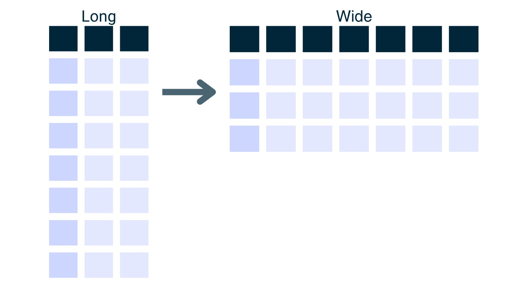
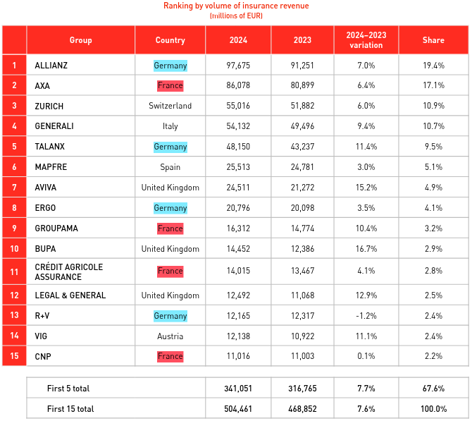
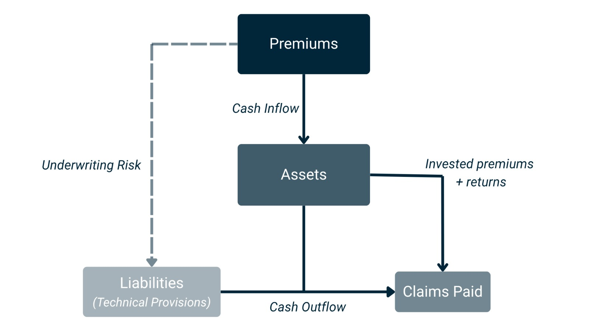

```{python}
#import libraries
import pandas as pd
import numpy as np
import geopandas as gpd
import geodatasets
import matplotlib.dates as mdates
from plotly import express as px 
import seaborn as sns
from matplotlib import pyplot as plt 
import requests
from IPython.display import display, HTML
import statsmodels.api as sm
import plotly.graph_objects as go
from scipy.optimize import curve_fit
from datetime import date
from plotly.subplots import make_subplots
from matplotlib.ticker import FuncFormatter

# download map 
europe = gpd.read_file("https://gisco-services.ec.europa.eu/distribution/v2/nuts/shp/NUTS_RG_01M_2021_4326.shp.zip")
europe = europe[europe["LEVL_CODE"] == 0]

# Managing GDP data 

indicator = "NY.GDP.PCAP.CD"     
years = "2017:2025"
url = (
    f"https://api.worldbank.org/v2/country/all/indicator/"
    f"{indicator}?date={years}&format=json&per_page=20000"
)
resp = requests.get(url)
print("Status code:", resp.status_code)

if resp.status_code != 200:
    print(resp.text[:1000])
    raise SystemExit("Error al llamar a la API del World Bank")

try:
    payload = resp.json()
except ValueError:
    print("Respuesta no es JSON, primeros caracteres:")
    print(resp.text[:500])
    raise

data = payload[1]  # posición 0 = metadatos, 1 = datos

gdp_raw = pd.DataFrame(data)[["country", "countryiso3code", "date", "value"]]
gdp_raw.rename(columns={"value": "GDP_per_capita"}, inplace=True)

# limpiar
gdp_raw = gdp_raw.dropna(subset=["GDP_per_capita"])
gdp_raw["GDP_per_capita"] = gdp_raw["GDP_per_capita"].astype(float)
gdp_raw["date"] = gdp_raw["date"].astype(int)

#Downloading datasets from EIOPA 
Own_Funds_Original=pd.read_csv("SQ_Own_Funds.csv",encoding="latin1")
Balance_Sheet_Original=pd.read_csv("SQ_Balance_Sheet.csv",encoding="latin1")
Premiums_Original=pd.read_csv("SQ_Premiums_Claims_Expenses.csv",encoding="latin1")
```
# Introduction

Insurance markets contribute significantly to economic stability by transforming uncertain risks into predictable financial commitments. As __[Arrow (1965)](https://doi.org/10.1007/978-3-642-20548-4)__ describes, insurance represents the exchange of money today for money payable contingent upon the occurrence of certain events. This essential function relies on the sector’s ability to maintain adequate capital buffers and withstand adverse conditions. According to the European Insurance and Occupational Pensions Authority __[(EIOPA)](https://www.eiopa.europa.eu/browse/regulation-and-policy/solvency-ii_en#background-how-and-why-solvency-ii-came-to-life)__, the **Solvency II prudential regime**, in force since January 2016, establishes the requirements that insurance and reinsurance undertakings must meet to ensure adequate protection of policyholders and beneficiaries __(EIOPA, n.d.)__.

Despite the existence of this harmonized regulatory framework, significant differences across countries persist within the European Union. These divergences arise from economic, demographic, and structural characteristics, such as population size, gross domestic product (GDP) levels, mortality patterns, as well as more subjective elements including culture and risk appetite. As a result, EU countries can exhibit varying solvency ratios __[(EIOPA, 2023)](https://reports.insuranceeurope.eu/annual-report-2024-2025/s/28/about-insurance-europe)__, financial structures, and capital management strategies shaped by national economic conditions, supervisory practices, and the composition of insurers’ balance sheets.

This study conducts a comparative analysis of Solvency II indicators provided by EIOPA databases across EU countries, with the principal objective of identifying structural diversity, examining differences in investment composition, and providing an evidence based understanding of how, despite a common regulatory regime, national economic contexts shape distinct solvency and financial patterns across insurance markets.


## Project Goals

Understanding how solvency levels, profitability, and expenses within insurance vary across countries and over time is of central importance in actuarial practice. Differences in insurers’ financial strength directly influence capital allocation, pricing strategies, and the early identification of potential financial stress. Similarly, recognising patterns in claims or premiums supports more accurate pricing, improved portfolio management, and stronger long-term risk control. Although this project will not explore the broader connection through all these areas, it seeks to present a very clear view of the available data in EIOPA Insurance Statistics website by offering insights that are relevant both for the stability of insurance companies and for the protection of policyholders.

The motivation for this project arises from the need to better understand and visually communicate the differences that exist across EU countries in terms of Solvency II indicators. We aim to detect if countries display significant variation in their solvency  indicators, investment structures, and financial performance. The specific Solvency II indicators examined in this study are introduced in Section 3 (Research Questions).

Therefore to accomplish such task, we established 2 main objectives:

- **Exploratory Data Analysis (EDA):** Perform a descriptive analysis of insurers’ financial structures for the year 2024, detailed by quarterly performance and univariate analysis of key variables, such as assets, liabilities, Solvency Capital Requirement (SCR) ratio, Minimum Capital Requirement (MCR) ratio, etc.

- **Development of Visual Tools:** Produce visualizations such as maps, histograms, correlation matrix, bar charts, and comparative plots that facilitate interpretation and highlight key differences across countries and over time. The time series analysis will focus on the period from 2017 to 2024 with the aim of analyzing changes in solvency and other financial measures and identifying trends in the European insurance market.

This section outlines the broader motivation and objectives of the project. The remainder of the paper is organised as follows. **Section 2** reviews the related work. **Section 3** introduces the research questions, with **Section 3.1** detailing the dataset alongside the preprocessing and data-cleaning procedures. **Sections 3.2.1, 3.2.2,** and **3.2.3** then present the analyses corresponding to Research Questions 1, 2, and 3. Finally, **Section 4** concludes the study by summarising the key findings from the perspective of both insurers and consumers.

## Related work 

Multiple lines of research have examined how insurers’ financial structures, investment decisions, and broader economic conditions influence solvency outcomes under the Solvency II framework. A broader macroeconomic perspective is offered by studies examining the insurance–growth nexus. In **[The Relationship Between Insurance and Economic Growth: Evidence from the European Union Countries](https://doi.org/10.1080/1331677x.2019.1588765)**, the authors analyse annual data from 2004 to 2015 to assess how insurance development interacts with economic growth **(Peleckienė et al., 2019)**. Their results show substantial cross-country heterogeneity: insurance sector development is generally higher in economically advanced countries, and the relationship between insurance penetration and economic growth varies significantly across member states. Some countries display positive and statistically significant relationships, others negative ones, and causality patterns differ across the EU, ranging from GDP-driven insurance growth to insurance-driven GDP growth or no detectable relationship.

Expanding on this line of inquiry, Siopi and Poufinas (2023) adopt a broader perspective in **[Impact of Internal and External Factors on Profitability and Financial Strength of Insurance Groups](https://doi.org/10.1007/s11294-023-09873-y )**. Studying 23 EU insurance groups from 2007 to 2021, they evaluate both profitability (ROA, ROE) and financial strength (equity-to-assets) in relation to firm-level characteristics and macroeconomic factors including GDP growth, inflation, long-term interest rates, and market structure. Their key conclusion is that, once these determinants are taken into account, the introduction of Solvency II does not exert a statistically significant effect on either profitability or financial strength **(Siopi & Poufinas, 2023)**. Instead, managerial efficiency, underwriting performance, portfolio composition, and broader economic conditions emerge as the dominant drivers. This result underscores that regulatory frameworks alone do not determine insurer performance; internal strategic decisions and macroeconomic environments often play a more decisive role.

Additional notable contributions include the study **[Enterprise Risk Management and Solvency: The Case of the Listed EU Insurers]((https://doi.org/10.1016/j.jbusres.2019.09.034))**investigates the relationship between Enterprise Risk Management (ERM) adoption and solvency. As well as **[Solvency II assumptions for increasing the international competitiveness of EU insurance industry]((https://doi.org/10.1016/j.sbspro.2013.12.927))** , where they analyze how Solvency II regime under implementation will help to increase the international competitiveness of EU insurance industry as they could reallocate own funds according the results of potential decrease or increase in solvency requirement relative to the standard formula. **(Peleckienė & Peleckis, 2014)**

Collectively, these studies emphasise that solvency, profitability, and financial resilience within EU insurance markets are shaped by a combination of investment structure, internal management decisions, risk-management practices, and broader macroeconomic conditions. They also highlight the cross-country variation that continues to exist despite the uniform regulatory environment established by Solvency II. However, none of these studies integrate all three dimensions within a single analysis.

In this paper, we aim to advance this discussion by examining the financial composition, solvency and profitability ratios of EU insurance companies to better understand how these elements relate to one another and how they differ across EU countries.

## Research questions

Trying to connect the previous ideas about how financial structure affects solvency and profitability, and how these dimensions relate to each other, we construct the following research questions:

- **How do solvency patterns vary across the European Union countries and does solvency impact the countries’ profitability?**

- **To what extent does the relationship between assets and liabilities correlate with premiums collected and claims paid across EU countries?**

- **To what extent does the financial structure and asset allocation (e.g., investments in bonds) of insurers correlate with the volume of premiums collected across EU countries?**

- **Is there a relationship between the premiums earned in each country relative to their GDP?**

In summary, we aim to understand how regulatory framework factors and risk-management practices vary across EU countries, and how these differences impact profitability.


<!-- TODO: We need to work more on this section - Expand with more details -->

# Data
## Sources
This project analyzes the financial structure and insurance activity of EU countries using official supervisory data published downloaded from: 

- **[European Insurance and Occupational Pensions Authority (EIOPA)](https://www.eiopa.europa.eu/index_en)**. 

  - **[Balance Sheet (B)](https://www.eiopa.europa.eu/tools-and-data/insurance-statistics_en#own-funds)**
  Contains country-level information on assets and liabilities, distinguishing between life and non-life business and including reinsurance recoverables. This dataset supports a detailed assessment of insurers’ financial positions under Solvency II.

  - **[Premiums, Claims and Expenses (PCE)](https://www.eiopa.europa.eu/tools-and-data/insurance-statistics_en#own-funds)**
  Reports gross and net premiums, claims incurred, changes in technical provisions, and operating expenses for life and non-life insurance. It provides insight into insurers’ underwriting activity and operational performance (EIOPA, 2024).

  - **[Own Funds (O)](https://www.eiopa.europa.eu/tools-and-data/insurance-statistics_en#own-funds)**
  Includes Solvency Capital Requirement (SCR) and Minimum Capital Requirement (MCR), both in absolute values and percentile distributions (10th–90th), separately for life, non-life, and other undertakings.

- **[World Bank](https://data.worldbank.org/)** 
    - Gross Domestic Price Idex

- **[Geographic Information System of the Commission.(GISCO)](https://ec.europa.eu/eurostat/web/gisco)**
    - Thematic and statistical maps of the European Union.

## Data Management and Preparation
The data management process was conducted through several structured stages. All datasets were provided in CSV format and represented quaterly financial data.

The initial stage consisted of gaining a thorough understanding of the datasets. This involved examining their structure, identifying the presence of missing values, determining the variables most relevant to the study, and reviewing the variable types available for the exploratory analysis phase. 

The variables identified as most relevant to the analysis were as follows: 
 <!-- TODO maybe change this format -->  

| Group                           | Variables (Common)                       | Other Variables                              | Description of Other Variables                               |
|--------------------------------|-------------------------------------------|-----------------------------------------------|--------------------------------------------------------------|
| **Balance Sheet**              | `Reporting country`, `Reference period`   | `Item name`, `Value (Balance Sheet)`          | Includes balance sheet components: Assets, Liabilities, etc.                              |
| **Premiums, Claims, Expenses** | `Reporting country`, `Reference period`   | `Item name`, `Value (PCE)`                    | Includes premium, claims, and expense components: Premiums Earned, Net Claims Incurred, etc.             |
| **Own Funds**           | `Reporting country`, `Reference period`   | `Item name`, `Value (Own Funds)`              | Includes solvency metrics: SCR absolute, MCR absolute, Total Technical Provisions, etc.                                   |

Before data processing, the individual datasets had the following dimensions:

```{python}
HTML(
f"""
<style>
.dataset-info {{
  display: flex;
  flex-wrap: wrap;
  justify-content: center;
  gap: 15px;
  margin-top: 10px;
}}

.dataset-box {{
  background-color: #eef4ff; 
  padding: 10px 20px;
  border-radius: 10px;
  font-weight: 500;
  color: #111827;
  box-shadow: 0 1px 3px rgba(0, 0, 0, 0.1);
  font-size: 1em;
  white-space: nowrap;
}}
</style>

<div class="dataset-info">
  <div class="dataset-box"><b>Balance Sheet:</b> {Balance_Sheet_Original.shape}</div>
  <div class="dataset-box"><b>Premiums:</b> {Premiums_Original.shape}</div>
  <div class="dataset-box"><b>Own Funds:</b> {Own_Funds_Original.shape}</div>
</div>
"""
)
```

## Data Collection and Loading

<!-- Important: Do not change the data loading approach shown below. The template uses project_root from the setup chunk to ensure your code works regardless of where the report is run from.
--> 
The initial inspection consisted of:

- Uploading each file to the working environment
- Using `.info()` and .`describe()` to inspect variable types, reporting frequency, and the extent of missing values

```{python}
def df_info_pretty(df):
    return pd.DataFrame({
        "non-null": df.notna().sum(),
        "nulls": df.isna().sum(),
        "dtype": df.dtypes.astype(str)
    })
df_info_pretty(Premiums_Original)
```

A key observation was that all datasets were in a “long format”, meaning:

- One column identified the variable (“Item Code” or “Item Name”)
- One column contained the corresponding numerical value



In our case, the original long structure (where each observation is stored in its own row and key identifiers such as Item Code and Value repeat) was not ideal for conducting cross-country and time-based financial analysis. A wide format is more appropriate because it consolidates each country-quarter into a single row and expands each Item Code into a dedicated column, simplifying merging, comparisons, and the computation of solvency or balance-sheet indicators. 

A single variable column (“Value”) and a variable identifier column (“Item Code/Name”) were present in all files.

## Data Wrangling and Reshaping
### Standardization and Pre-processing

Before combining the datasets, several preparation steps were performed:

- Standardization of country names and reporting dates
- Verification that no duplicate country–quarter entries were present
- Filtering to retain only the variables relevant to the analysis
- Removal of the EEA aggregated record in the PCE and Own Funds datasets to avoid double counting

A dictionary was constructed to map each **Item Code → Descriptive** Item Name, ensuring interpretability while keeping concise variable labels.
```{python}
#Creating dictionary's code 
Balance_Sheet_Original['Item code'] = Balance_Sheet_Original['Item code'].astype(str) + '_BS'
Premiums_Original['Item code'] = Premiums_Original['Item code'].astype(str) + '_P'
Own_Funds_Original['Item code'] = Own_Funds_Original['Item code'].astype(str) + '_O'

Codes = (
    pd.concat([
        Balance_Sheet_Original[['Item code', 'Item name']],
        Premiums_Original[['Item code', 'Item']].rename(columns={'Item': 'Item name'}),
        Own_Funds_Original[['Item code', 'Item name']]
    ])
    .drop_duplicates(subset=['Item code'])
    .reset_index(drop=True))
```

### Reshaping from Long to Wide Format
Since all datasets shared the same key identifier (**Reporting Country + Reference Period**), each dataset was transformed from **long → wide** format:

- One row per country-quarter
- Each Item Code becomes a separate column
- A suffix indicating the originating dataset was added (e.g., `R0500_B, R0110_PCE, R0200_O`) to retain traceability.
```{python}
#Fixing reference period 
#Balance sheet 
Balance_Sheet_Original['Year'] = Balance_Sheet_Original['Reference period'].str.extract(r'(\d{4})').astype(int)
Balance_Sheet_Original['Quarter'] = Balance_Sheet_Original['Reference period'].str.extract(r'(Q\d)')[0]
Balance_Sheet_Original['Date'] = pd.PeriodIndex(    Balance_Sheet_Original['Year'].astype(str) + Balance_Sheet_Original['Quarter'],freq='Q').to_timestamp()
Balance_Sheet_Original.drop(columns=['Year', 'Quarter'], inplace=True)
#Premiums, claims and expenses
Premiums_Original['Year'] = Premiums_Original['Reference period'].str.extract(r'(\d{4})').astype(int)
Premiums_Original['Quarter'] = Premiums_Original['Reference period'].str.extract(r'(Q\d)')[0]
Premiums_Original['Date'] = pd.PeriodIndex(Premiums_Original['Year'].astype(str) + Premiums_Original['Quarter'],freq='Q').to_timestamp()
Premiums_Original.drop(columns=['Year', 'Quarter'], inplace=True)
#Own Funds 
Own_Funds_Original['Year'] = Own_Funds_Original['Reference period'].str.extract(r'(\d{4})').astype(int)
Own_Funds_Original['Quarter'] = Own_Funds_Original['Reference period'].str.extract(r'(Q\d)')[0]
Own_Funds_Original['Date'] = pd.PeriodIndex(Own_Funds_Original['Year'].astype(str) + Own_Funds_Original['Quarter'],freq='Q').to_timestamp()
Own_Funds_Original.drop(columns=['Year', 'Quarter'], inplace=True)

#Using just the colums we are interested in 
Balance_Sheet = Balance_Sheet_Original[['Reporting country','Date', 'Value','Item code']]
Premiums = Premiums_Original[['Reporting country','Date', 'Value','Item code']]
Own_Funds = Own_Funds_Original[['Reporting country','Date', 'Value','Item code']]

Balance_Sheet_wide = (
    Balance_Sheet.pivot_table(
        index=['Reporting country', 'Date'],
        columns='Item code',
        values='Value',
        aggfunc='sum',# sum duplicates
        #fill_value=0 # optional: replace NaNs with 0
    )
    .reset_index()
)

Premiums_wide = (
    Premiums.pivot_table(
        index=['Reporting country', 'Date'],
        columns='Item code',
        values='Value',
        aggfunc='sum',# sum duplicates
        #fill_value=0
    )
    .reset_index()
)

Own_Funds_wide = (
    Own_Funds.pivot_table(
        index=['Reporting country', 'Date'],
        columns='Item code',
        values='Value',
        aggfunc='mean',#use mean to agregate because this are ratios. 
        #fill_value=0
    )
    .reset_index()
)
#Exclude EDA
Premiums_wide=Premiums_wide[Premiums_wide['Reporting country']!='EEA']
Own_Funds_wide=Own_Funds_wide[Own_Funds_wide['Reporting country']!='EEA']
```
### Merging the Datasets

Using **Reporting Country** and **Reference Period** as merge keys, the three reshaped datasets were integrated into a single unified table.
```{python}
df = pd.merge(Balance_Sheet_wide, Premiums_wide, on=["Reporting country", "Date"], how="outer")
df = pd.merge(df, Own_Funds_wide, on=["Reporting country", "Date"], how="outer")
```

 Data types were then standardized:
```{python}
HTML(f"""
<style>
  .dtype-code {{
    background: #e8e8ff;
    color: #333;
    padding: 3px 6px;
    border-radius: 4px;
    font-family: monospace;
  }}
</style>

<ul>
  <li><b>Numeric values:</b> <span class="dtype-code">{df["R0040_BS"].dtype}</span></li>
  <li><b>Reporting country:</b> <span class="dtype-code">{df["Reporting country"].dtype}</span></li>
  <li><b>Reporting dates:</b> <span class="dtype-code">{df["Date"].dtype}</span></li>
</ul>
""")
```

### Time Window Selection
Although the raw files span **Q3 2016–Q2 2025**, the project uses **Q1 2017–Q4 2024**, to ensure full-year consistency and avoid partially reported quarters.

## Missing Values and Outliers
### Missing Values 

- Balance Sheet: Many missing values are inherent to the template (e.g., items not applicable to certain markets). These missing entries were not imputed unless analytically required. (See Appendix.)
- Premiums, Claims and Expenses & Own Funds: Missing values were minimal and primarily related to non-reported items. No imputation was applied.
- GDP Data: Missing values were treated by forward-filling or removing years without complete coverage, depending on the analysis.

### Outliers 

Preliminary descriptive statistics and visual inspections (boxplots and percentile checks) did not reveal data-quality outliers beyond natural cross-country variation. Since EIOPA data is validated by supervisory authorities, extreme values were treated as true economic observations, not data errors.

## Final Dataset 

After all wrangling steps, the final merged dataset contained:
1079 rows (country-quarter observations)
159 columns (wide-format financial indicators)
The dataset meets the project requirement of having over 1,000 observations, which would not have been achievable using annual data alone. Its unified structure supports consistent visualization, comparability across countries, and robust statistical analysis.

```{python} 
HTML(
f"""
<style>
.dataset-info {{
  display: flex;
  flex-wrap: wrap;
  justify-content: center;
  gap: 15px;
  margin-top: 10px;
}}

.dataset-box {{
  background-color: #eef4ff; 
  padding: 10px 20px;
  border-radius: 10px;
  font-weight: 500;
  color: #111827;
  box-shadow: 0 1px 3px rgba(0, 0, 0, 0.1);
  font-size: 1em;
  white-space: nowrap;
}}
</style>

<div class="dataset-info">
  <div class="dataset-box"><b>Final dataset shape:</b> {df.shape}</div>
</div>
"""
)
```
# Expolatory Data Analysis
## Research Question 1 
### How do solvency patterns vary across EU countries? 
In the first section, we aim to identify solvency patterns across European Union countries and analyze how these indicators correlate with one another. To achieve this, we first define the key solvency factors relevant under the Solvency II regulatory framework. 

- **Solvency Capital Requirement Ratio (SCR Ratio)**: It measures whether an insurer holds sufficient eligible own funds to meet its Solvency Capital Requirement (SCR), which represents the level of capital that insurers must hold to ensure they can absorb unexpected losses with a 99.5% confidence level over a one-year horizon. [@SCRDef]

  $$
    \text{SCR Ratio} = 
    \frac{\text{Eligible Own Funds}}
    {\text{Solvency Capital Requirement (SCR)}}
  $$

- **Minimum Capital Requirement Ratio (MCR Ratio)**: It represents the minimum level of capital that an insurer must hold to ensure short-term financial stability. Federal Financial Supervisory Authority. [@MCRDef] If an insurer’s eligible own funds fall below the MCR, supervisors must take immediate action to protect policyholders and restore the insurer’s solvency position.

  $$
    \text{MCR Ratio} = \frac{\text{Own Funds}}{\text{MCR}}
  $$

-  **Own Funds**: It consists of the excess of assets over liabilities. These represent the available capital that can be used to absorb losses and meet solvency requirements [@EIOPA]

  $$
    \text{Own Funds} = \text{Assets} - \text{Liabilities}
  $$

- **Technical Provisions**: Technical provisions represent a specific category of liabilities that insurers must hold to cover expected future policyholder obligations. They are calculated based on the best estimate of future cash flows, adjusted for the time value of money and a risk margin. [@EIOPA]

  $$
  \text{Technical Provisions} =
  \text{Best Estimate (BE)} + \text{Risk Margin (RM)}
  $$

Given that we expect multiple interdependencies among solvency indicators, we begin the analysis by constructing a scatter plot matrix. This visualization allows us to observe pairwise relationships across variables simultaneously, detect potential correlations, and gain an initial understanding of the distribution of each variable (as each variable is plotted against itself along the diagonal).

```{python} 
#Create and duplicate required columns with proper names for better understanding.
new_cols = pd.DataFrame({
    "Own_Funds": df["R0540_O"],
    "SCR_ratio": df["R0620_O"],
    "MCR_ratio": df["R0640_O"],
    "Total_TP": df[["R0510_BS", "R0600_BS", "R0690_BS"]].sum(axis=1),
    "Total_Assets": df["R0500_BS"],
    "Total_Liabilities": df["R0900_BS"],
})
df = pd.concat([df, new_cols], axis=1)
cols = ["Own_Funds","SCR_ratio","MCR_ratio","Total_TP"] #
sns.set_theme()
sns.pairplot(df[cols], diag_kind="hist", corner=True)
plt.show()
```

The scatter-plot matrix reveals three key patterns. First, the SCR ratio and MCR ratio exhibit a strong, almost linear relationship, indicating that both variables capture the same underlying solvency dimension. This suggests that the SCR ratio alone can serve as a sufficiently informative measure for following comparative analyses.

Second, Own Funds and Technical Provisions display clear clustering patterns. These clusters reflect substantial differences in company size across European markets, which could be driven by factors such as economic conditions, interest rates, and demographic trends.

Finally, the relationships between size variables (Own Funds and Technical Provisions) and solvency ratios (SCR and MCR) appear relatively weak. This implies that solvency levels are not predominantly determined by firm size but instead by insurers’ risk profiles, business models, and supervisory practices across EU countries. This pattern aligns with the statistical findings reported by **Poufinas and Siopi**,  who also document a limited direct dependence of solvency ratios on firm size. However, a deeper and more robust analysis is required to prove this hypothesis. [@PoufinasSiopi2024]

Overall, the scatter-plot matrix points to a structurally segmented European insurance market, where solvency levels and firm size vary across countries. Because these differences may be partly driven by geographical or country-specific factors, the next logical step is to examine a map plot, allowing us to compare how these indicators vary across countries. 

```{python}
df["log_Own_Funds"] = np.log1p(df["Own_Funds"])
df["log_TP"] = np.log1p(df["Total_TP"])
df["Country"] = df["Reporting country"]
df["date"] = pd.to_datetime(df["Date"]) #creates a copy of Date bu transforming it to datetime
df["year"] = df["date"].dt.year
df["quarter"] = df["date"].dt.quarter
df["year_quarter"] = df["date"].dt.to_period("Q").astype(str).str.replace("Q", " Q")

#
N = 5  # how many to sho, the 5 more higer and 5 more lower just of the 2025 Q2
top_countries = df[df["year_quarter"] == "2025 Q2"].nlargest(N, "SCR_ratio")
bottom_countries = df[df["year_quarter"] == "2025 Q2"].nsmallest(N, "SCR_ratio")

df_lastquarter = df[df["year_quarter"] == "2025 Q2"].copy() #just last quarter
df_lastquarter["Country"] = df_lastquarter["Country"].str.upper() 
#map 
map_df = europe.merge(df_lastquarter, left_on="CNTR_CODE", right_on="Country", how="left")
unmatched = df_lastquarter.loc[~df_lastquarter["Country"].isin(europe["CNTR_CODE"]), "Country"].unique()
#
name_to_iso2 = {
    "AUSTRIA":"AT", "BELGIUM":"BE", "CROATIA":"HR", "CYPRUS":"CY",
    "CZECHIA":"CZ", "DENMARK":"DK", "ESTONIA":"EE", "FINLAND":"FI",
    "GERMANY":"DE", "GREECE":"EL", "HUNGARY":"HU", "ICELAND":"IS",
    "IRELAND":"IE", "ITALY":"IT", "LATVIA":"LV", "LITHUANIA":"LT",
    "NETHERLANDS":"NL", "NORWAY":"NO", "POLAND":"PL", "ROMANIA":"RO",
    "SLOVAKIA":"SK", "SLOVENIA":"SI", "SPAIN":"ES", "SWEDEN":"SE", "BULGARIA": "BG",
    "FRANCE": "FR",
    "LIECHTENSTEIN": "LI",
    "LUXEMBOURG": "LU",
    "MALTA": "MT",
    "PORTUGAL": "PT"
}

#
df_lastquarter["CNTR_CODE"] = df_lastquarter["Country"].map(name_to_iso2)
#
missing = df_lastquarter.loc[df_lastquarter["CNTR_CODE"].isna(), "Country"].unique()
#
map_df = europe.merge(df_lastquarter, on="CNTR_CODE", how="left")
```

::: {.panel-tabset}
## SCR Ratio 
```{python}

fig = px.choropleth(
    map_df,
    geojson=map_df.geometry.__geo_interface__,
    locations=map_df.index,
    color="SCR_ratio",
    hover_name="Country",
    color_continuous_scale="Blues",
    labels={"SCR_ratio": "SCR (x)"},
    title="SCR Ratio by Country — 2025 Q2"
)

fig.update_geos(
    visible=False,
    lonaxis=dict(range=[-10, 30]),   # cambia estos valores según tu región
    lataxis=dict(range=[35, 65])     # idem
)

fig.update_layout(
    width=800,
    height=600,
    margin=dict(l=0, r=0, t=40, b=0)
)

fig.show()
```
## Own Funds 
``` {python} 
top_OF= df[df["year_quarter"] == "2025 Q2"].nlargest(N, "Own_Funds")
bottom_OF= df[df["year_quarter"] == "2025 Q2"].nsmallest(N, "Own_Funds")

fig = px.choropleth(
    map_df,
    geojson=map_df.geometry.__geo_interface__,
    locations=map_df.index,
    color="Own_Funds",
    hover_name="Country",
    color_continuous_scale="Reds",
    labels={"Own_Funds": "Absolute Own Funds"},
    title="Own Funds Volume by Country — 2025 Q2"
)

fig.update_geos(
    visible=False,
    lonaxis=dict(range=[-10, 30]),   # cambia estos valores según tu región
    lataxis=dict(range=[35, 65])     # idem
)

fig.update_layout(
    width=800,
    height=600,
    margin=dict(l=0, r=0, t=40, b=0)
)

fig.show()
Own_ts = df.groupby(["Country", "date"])["Own_Funds"].mean().reset_index()

```
## Technical Provisions  
``` {python} 
top_TP= df[df["year_quarter"] == "2025 Q2"].nlargest(N, "Total_TP")
bottom_TP= df[df["year_quarter"] == "2025 Q2"].nsmallest(N, "Total_TP")
fig = px.choropleth(
    map_df,
    geojson=map_df.geometry.__geo_interface__,
    locations=map_df.index,
    color="Total_TP",
    hover_name="Country",
    color_continuous_scale="Oranges",
    labels={"Total_TP": "Technical Provisions"},
    title="Total Technical Provisions by Country — 2025 Q2"
)

fig.update_geos(
    visible=False,
    lonaxis=dict(range=[-10, 30]),   # cambia estos valores según tu región
    lataxis=dict(range=[35, 65])     # idem
)

fig.update_layout(
    width=800,
    height=600,
    margin=dict(l=0, r=0, t=40, b=0)
)

fig.show()
TP_ts = df.groupby(["Country", "date"])["Total_TP"].mean().reset_index()
```
:::

Germany and Austria exhibit the highest average SCR ratios, reflecting stronger solvency positions. Despite differences in market scale, both operate under robust supervisory frameworks alongside the Solvency II regime (BaFin in Germany and the Financial Market Authority in Austria). Overall, EU countries display healthy SCR ratios. 

The segmentation of Own Funds and Technical Provisions is more pronounced, forming two distinct groups with a clear concentration in Central European countries. France and Germany dominate with the largest volumes. This is consistent with their status as two of the largest insurance markets in Europe and their high levels of insurance penetration (an aspect that will be examined further in subsequent research questions). [@FundacionMAPFRE2025]


{fig-align="center" width="60%"}

Having identified segmentation across countries, the next step is to examine whether these differences in solvency factors are persistent over time or merely reflect conditions in the most recent period. Countries are classified into a high-solvency and a low-solvency group to evaluate whether the observed gap persists over time. 

```{python}
#| warning: false
#TODO : Revisar el warning 
top_countriesSR = df[df["year_quarter"] == "2024 Q4"].nlargest(N, "SCR_ratio")
bottom_countriesSR = df[df["year_quarter"] == "2024 Q4"].nsmallest(N, "SCR_ratio")

high_countries = top_countries["Country"].unique()
low_countries = bottom_countries["Country"].unique()

def label_group(country):
    if country in high_countries:
        return "High solvency"
    elif country in low_countries:
        return "Low solvency"
    else:
        return "Other"

df["Group"] = df["Country"].apply(label_group)

df_10SR= df[df["Group"].isin(["High solvency", "Low solvency"])]
order = sorted(df_10SR["year_quarter"].unique())
df_10SR["year_quarter"] = pd.Categorical(df_10SR["year_quarter"],
                                       categories=order,
                                       ordered=True)

# Average SCR
evol_mcr = (
    df_10SR
    .groupby(["year_quarter", "Group"])["SCR_ratio"]
    .mean()
    .reset_index()
)

plt.figure(figsize=(8,4))
sns.lineplot(
    data=evol_mcr,
    x="year_quarter",
    y="SCR_ratio",
    hue="Group",
    marker="o"
)
plt.title("Evolution of SCR ratio — Top 5 vs Bottom 5 Countries")
plt.xlabel("Year-Quarter")
plt.ylabel("SCR ratio")
plt.legend(title="Group")
plt.xticks(rotation=90, fontsize=7)  #Font size 
plt.tight_layout()
plt.show()
```

The results reveal a consistent and stable gap over time: from 2017 to 2024 Q4, high-solvency countries maintain ratios between approximately 2.4 and 3.0, operating well above regulatory thresholds, whereas low-solvency countries remain in the 1.7-1.9 range with limited upward movement.These findings suggest that solvency differences are structural rather than cyclical. 

An interesting pattern emerges during the COVID-19 period: high-solvency countries experienced a notable temporary decline in their SCR ratios than low-solvency countries. Although this may seem counterintuitive, it is consistent with structural differences in market size, portfolio composition, and exposure to shocks. First, larger and more diversified insurers have greater exposure to financial-market volatility, and the main solvency shock during 2020 came from investment-side impacts rather than claims.[@Pulawska2021] This aligns with the conclusion reached by Poufinas and Siopi, who emphasize the dominant role of investment-side impacts in shaping the solvency position of insurers. [@PoufinasSiopi2024] This link between solvency behaviour and investment-side dynamics will be examined again in the subsequent research questions.
 <!-- TODO : check if it's possible do the same analysisis for Owns Funds and Technical Ptovisions -->

### Does solvency impact insurers’ profitability?

After comparing solvency across EU countries, the next step is to understand whether higher solvency levels actually lead to better financial performance. To explore this connection, we focus on key profitability indicators in the non-life insurance sector.

We restrict the profitability analysis to non-life insurance, where the relationship between premiums, claims, and expenses is short-term and directly linked to underwriting performance. Life insurance profitability depends heavily on long-term reserving and investment returns, which introduce additional complexity and make solvency-profitability relationships harder to isolate. By focusing on non-life, we ensure that performance ratios reflect operational outcomes rather than long-term financial effects. In literature the most common profitability ratios are the following: 

- **Combined Ratio**

It measures the overall underwriting performance of non-life insurers. It indicates whether the core insurance activity is profitable before considering investment income.
$$
  \text{CR} = 
  \frac{\text{Claims incurred + Expenses}}
  {\text{Premiums earned
}}
$$

- **Loss Ratio**

  It measures the proportion of premiums that go toward paying claims. It reflects the insurer’s ability to price risk appropriately and control losses.
$$
  \text{LR} = 
  \frac{\text{Claims incurred}}
  {\text{Premiums earned
}}
$$

- **Expense Ratio**
  
  It measures how much of the premium income is consumed by operating expenses, such as commissions, underwriting costs, and administration.

$$
  \text{ER} = 
  \frac{\text{Expenses}}
  {\text{Premiums earned
}}
$$

```{python} 

new_colsP = pd.DataFrame({
    "NetPremiumsEarn": df["R0300_P"],
    "NetClaimsIncurred": df["R0400_P"],
    "NetExpensesIncurred": df["R0550_P"],
})
df = pd.concat([df, new_colsP], axis=1)
#Creation of proftability ratios columns
df["Loss_Ratio"] = df["NetClaimsIncurred"] / df["NetPremiumsEarn"]
df["Expense_Ratio"] = df["NetExpensesIncurred"] / df["NetPremiumsEarn"]
df["Combined_Ratio"] = (df["NetClaimsIncurred"] + df["NetExpensesIncurred"]) / df["NetPremiumsEarn"]
#Computing Profitability Ratios
df["Technical_Profit"] = (df["NetPremiumsEarn"] - df["NetClaimsIncurred"] - df["NetExpensesIncurred"])
df["OwnFunds_Total"] = df["R1000_BS"].copy()
df["ROOF"] = df["Technical_Profit"] / df["OwnFunds_Total"] 
```

To compare performances across countries, we use a boxplot representation. It allows us to visualize both the central tendency and the variability of the Combined Ratio over time within each country. This is particularly important in the insurance context, where volatility in claims can result in significant fluctuations in underwriting results. Wider distributions indicate more unstable performance, while narrow boxes suggest consistent results across periods. 

This approach not only highlights which countries are more profitable on average but also reveals differences in stability, helping us identify markets where profitability may be more sensitive to risk shocks or pricing conditions.

::: {.panel-tabset}
## Combined Ratio
```{python} 
plt.figure(figsize=(8, 4))

sns.boxplot(
    data=df,
    x="Country",
    y="Combined_Ratio",
    color="#214c8d"  # naranja claro
)

plt.xticks(rotation=90)
plt.title("Distribution of Combined Ratio by Country (EU Insurance Sector)")
plt.xlabel("Country")
plt.ylabel("Combined Ratio")
plt.tight_layout()
plt.show()
```
## Expense Ratio 
```{python}
plt.figure(figsize=(8, 4))

sns.boxplot(
    data=df,
    x="Country",
    y="Expense_Ratio",
    color = "#5565f7ff"  # mismo naranja claro
)

plt.xticks(rotation=90)
plt.title("Distribution of Expense Ratio by Country (EU Insurance Sector)")
plt.xlabel("Country")
plt.ylabel("Expense Ratio")
plt.tight_layout()
plt.show()
```
## Loss Ratio 
``` {python}
plt.figure(figsize=(8, 4))

sns.boxplot(
    data=df,
    x="Country",
    y="Loss_Ratio",
    color = "#df1300"  # mismo color naranja
)

plt.xticks(rotation=90)
plt.title("Distribution of Loss Ratio by Country (EU Insurance Sector)")
plt.xlabel("Country")
plt.ylabel("Loss Ratio")
plt.tight_layout()
plt.show()
```
:::

The boxplots show that countries such as Malta and Lithuania exhibit significantly higher volatility in their Combined Ratio. This is consistent with smaller and less diversified markets, where isolated events can materially impact aggregate results. In contrast, larger markets such as Germany, Norway, and the Netherlands display more stable distributions, reflecting a greater ability to absorb risks.

Although both the Expense Ratio and the Loss Ratio drive underwriting profitability, the variability observed in the Combined Ratio appears to be primarily driven by the Loss Ratio, as their distributions show more similar patterns of dispersion. The Expense Ratio, by comparison, exhibits lower variability across countries.

To further explore these relationships and to understand how solvency indicators interact with profitability metrics a correlation matrix will be computed and visualized it through a heatmap.

```{python}
df_relation = df.groupby("Country")[["SCR_ratio","Own_Funds","Total_TP", "Combined_Ratio","Loss_Ratio", "Expense_Ratio"
]].mean()
plt.figure(figsize=(8, 6))

sns.heatmap(
    df_relation.corr(),
    annot=True,
    cmap="coolwarm",
    fmt=".2f",
    annot_kws={"size": 10},   # tamaño de los números
    cbar_kws={"shrink": 1} # barra más pequeña (opcional)
)

plt.xticks(rotation=90, ha="right", fontsize=9)
plt.yticks(rotation=0, fontsize=10)

plt.title("Correlation Matrix", fontsize=12, fontweight="bold")
plt.tight_layout()
plt.show()
```

The heatmap confirms a strong negative correlation between the Loss Ratio and the Expense Ratio (-0.87). This pattern reflects differences in business models: firms operating with leaner cost structures, such as low-cost distribution channels, often compete through more aggressive pricing strategies, which may lead to higher incurred losses. Conversely, insurers with higher expense levels typically rely on more service-intensive or intermediated distribution models and therefore maintain lower loss ratios to preserve profitability. 

We also observe a strong positive correlation between Own Funds and Technical Provisions (0.94). This result is expected, as larger insurers with more mature portfolios accumulate higher technical provisions and consequently require higher levels of own funds. 

The heatmap also reveals several additional relationships between solvency and profitability factors.  

First, the SCR ratio is **negatively correlated** with both the Combined Ratio and the Loss Ratio. Insurers with higher SCR ratios tend to exhibit stronger underwriting performance, such as better risk selection, more disciplined pricing, and more effective reinsurance strategies, resulting in lower loss and combined ratios.

Second, the SCR ratio shows a light **positive correlation** with the Expense Ratio. Large, well-capitalized insurers often operate multiple business lines, manage sophisticated investment portfolios, etc. Such operational complexity increases commissions, administrative costs, and system expenses, leading to higher expense ratios.

Third, Own Funds and Technical Provisions are **positively correlated** with the Loss and Combined Ratios. Large insurers handle greater business volumes and thus experience more claims in absolute terms, which can raise loss ratios and combined ratios.

Overall, these patterns indicate that solvency factors influence profitability ratios in different ways, and that these correlations arise from multifactorial mechanisms shaping how the underlying variables interact. Differences in underwriting strategy, operational structure, business models, and portfolio composition all contribute to the way solvency and performance indicators relate to one another.

An interesting next step is to examine how the solvency and profitability of the insurance sector relate to countries’ levels of economic development. To explore this connection, GDP per capita will be incorporated into the analysis and visualized through a regression plot, providing initial insights into whether stronger solvency/profitability are associated with higher economic performance.

```{python}
df_relation2 = df_relation.reset_index()

iso_to_country = {
    "AUT": "AUSTRIA",
    "BEL": "BELGIUM",
    "BGR": "BULGARIA",
    "HRV": "CROATIA",
    "CYP": "CYPRUS",
    "CZE": "CZECHIA",
    "DNK": "DENMARK",
    "EST": "ESTONIA",
    "FIN": "FINLAND",
    "FRA": "FRANCE",
    "DEU": "GERMANY",
    "GRC": "GREECE",
    "HUN": "HUNGARY",
    "ISL": "ICELAND",
    "IRL": "IRELAND",
    "ITA": "ITALY",
    "LVA": "LATVIA",
    "LIE": "LIECHTENSTEIN",
    "LTU": "LITHUANIA",
    "LUX": "LUXEMBOURG",
    "MLT": "MALTA",
    "NLD": "NETHERLANDS",
    "NOR": "NORWAY",
    "POL": "POLAND",
    "PRT": "PORTUGAL",
    "ROU": "ROMANIA",
    "SVK": "SLOVAKIA",
    "SVN": "SLOVENIA",
    "ESP": "SPAIN",
    "SWE": "SWEDEN",
}

gdp_raw["Country"] = gdp_raw["countryiso3code"].map(iso_to_country)
gdp_eu = gdp_raw.dropna(subset=["Country"])
# Average GDP per capita per country 2017-2025
gdp_avg = (
    gdp_eu
    .groupby("Country")["GDP_per_capita"]
    .mean()
    .reset_index()
)

df_full = df_relation2.merge(gdp_avg, on="Country", how="left")
df_full["log_GDP"] = np.log(df_full["GDP_per_capita"])
```

::: {.panel-tabset}

## SCR Ratio vs GDP per Capita
```{python}

plt.figure(figsize=(7,5))

sns.regplot(
    data=df_full,
    x="log_GDP",
    y="SCR_ratio",
    color="#0e377a",
    line_kws={"color": "black", "linewidth": 1}
)

plt.title("SCR Ratio vs GDP per Capita (log scale)")
plt.xlabel("GDP per capita (log)")
plt.ylabel("SCR Ratio")
plt.xticks(fontsize=6)
plt.yticks(fontsize=6)

plt.tight_layout()
plt.show()
```

## Combined Ratio vs GDP per Capita 
```{python}
plt.figure(figsize=(7,5))

sns.regplot(
data=df_full,
x="log_GDP",
y="Combined_Ratio",
color="#ff8c00",
line_kws={"color": "black", "linewidth": 1}
)

plt.title("Combined Ratio vs GDP per Capita (log scale)")
plt.xlabel("GDP per capita (log)")
plt.ylabel("Combined Ratio")
plt.xticks(fontsize=8)
plt.yticks(fontsize=8)

plt.tight_layout()
plt.show()
```

:::

The regression plots between GDP per capita (log scale) and both the SCR ratio and the Combined Ratio reveal only weak linear relationships. The SCR ratio shows a slightly positive association with GDP per capita, suggesting that insurers in wealthier countries may exhibit somewhat stronger solvency positions, although the effect is small and the dispersion is considerable. Similarly, the Combined Ratio displays a slight upward trend with GDP per capita, potentially reflecting higher operating costs or greater market competitiveness in more developed countries, which can compress pricing margins and result in slightly higher combined ratios.

These results support the hypothesis of **Sipi and Toufinas** that Solvency II has no statistically significant impact either on profitability or on financial strength. . Although, this will be examined more in the following research questions. Overall, country-level wealth does not appear to be a strong determinant of either solvency or profitability in the European insurance sector.

## Research Question 2
### How do levels of insurers’ assets and liabilities correlate with country-level premiums written and claims incurred across EU insurance markets? 

Understanding the relationship between balance sheet components and operational cash flows is central to analysing the financial stability of insurance markets. In practice, cash inflows, outflows, and accumulated stocks form an integrated system where premiums, claims, assets, and liabilities influence each other over time.
```{python}

Life_B=Balance_Sheet_Original[Balance_Sheet_Original['Undertaking type']=='Life undertakings'].copy()
NonLife_B=Balance_Sheet_Original[Balance_Sheet_Original['Undertaking type']=='Non-Life undertakings'].copy()
Life_B=Life_B[['Reporting country','Date', 'Value','Item code']]
NonLife_B=NonLife_B[['Reporting country','Date', 'Value','Item code']]
Life_B = (
    Life_B.pivot_table(
        index=['Reporting country', 'Date'],
        columns='Item code',
        values='Value',
        aggfunc='sum',           
        fill_value=0
    )
    .reset_index()
)
NonLife_B = (
    NonLife_B.pivot_table(
        index=['Reporting country', 'Date'],
        columns='Item code',
        values='Value',
        aggfunc='sum',           
        fill_value=0
    )
    .reset_index()
)
Life_B=Life_B[['Reporting country','Date','R0500_BS','R0900_BS']]
NonLife_B=NonLife_B[['Reporting country','Date','R0500_BS','R0900_BS']]
Life_B = Life_B.rename(columns={'R0500_BS': 'R0500_BS_L', 'R0900_BS': 'R0900_BS_L'})
NonLife_B = NonLife_B.rename(columns={'R0500_BS': 'R0500_BS_NL', 'R0900_BS': 'R0900_BS_NL'})
RQ3=df[['Reporting country','Date','R0500_BS','R0900_BS', 'R0110_P', 'R1410_P','R0310_P','R1610_P']].copy()
RQ3 = RQ3.merge(Life_B, on=["Reporting country", "Date"], how="outer")
RQ3 = RQ3.merge(NonLife_B, on=["Reporting country", "Date"], how="outer")

#General
RQ3_General=RQ3.copy()
RQ3_General['Premiums']=RQ3_General['R0110_P']+RQ3_General['R1410_P']
RQ3_General['Claims']=RQ3_General['R0310_P']+RQ3_General['R1610_P']
RQ3_General.drop(columns=['R0110_P', 'R1410_P','R0310_P','R1610_P','R0500_BS_L','R0900_BS_L','R0500_BS_NL','R0900_BS_NL'], inplace=True)
RQ3_General = RQ3_General.rename(columns={'R0500_BS': 'Assets', 'R0900_BS': 'Liabilities'})

num_cols = RQ3_General.select_dtypes(include='number').columns
RQ3_General[num_cols] = RQ3_General[num_cols] * 1000

df_numeric = RQ3_General.select_dtypes(include=['number'])
correlation_matrix = df_numeric.corr(method='pearson')

```

**Conceptual Background**



Premiums represent inflows from policyholders. Higher volumes of written premiums increase future claim obligations, thereby raising technical liabilities. At the same time, premiums generate immediately investable cash, which expands the asset base.
Claims, conversely, are outflows that reduce available resources. Persistent or unusually large claims can erode investment assets or force insurers to adjust technical provisions, affecting both solvency and profitability.

Assets therefore capture accumulated premiums together with investment returns, while liabilities represent the expected value of future claims. The growth balance between these two elements directly influences solvency buffers and the insurer’s capacity to meet obligations without adjusting premiums. These relationships are naturally shaped by market conditions such as interest rates, investment performance, inflation, or exceptional loss events.

**Correlation Structure at the EU Aggregate Level**

::: {.panel-tabset}
## Overall Data
```{python}
#Figure 2
# Mask only the upper triangle (keep diagonal)
mask = np.triu(np.ones_like(correlation_matrix, dtype=bool), k=1)

plt.figure(figsize=(8, 6))
sns.set_style("white")

ax = sns.heatmap(
    correlation_matrix,
    mask=mask,
    annot=True,
    cmap=sns.light_palette("navy", as_cmap=True),
    fmt=".2f",
    linewidths=0.8,
    cbar=False,
    annot_kws={"size": 11}
)

plt.title(
    'EU Correlations – Assets, Liabilities, Premiums & Claims\nOverall Data',
    fontsize=15,
    fontweight='bold',
    pad=20
)

# Keep ticks (variable names), remove axis *titles*
ax.set_xlabel("")   # removes the x-axis title ("Item code")
ax.set_ylabel("")   # removes the y-axis title ("Item code")

plt.xticks(rotation=45, ha="right")
plt.yticks(rotation=0)

sns.despine(left=True, bottom=True)
plt.tight_layout()

```

## Life Business Line 
```{python}
#Figure 2

#Life 
RQ3_life=RQ3.copy()
RQ3_life['Premiums']=RQ3_life['R1410_P']
RQ3_life['Claims']=RQ3_life['R1610_P']
RQ3_life.drop(columns=['R0110_P', 'R1410_P','R0310_P','R1610_P','R0500_BS','R0900_BS','R0500_BS_NL','R0900_BS_NL'], inplace=True)
RQ3_life = RQ3_life.rename(columns={'R0500_BS_L': 'Assets', 'R0900_BS_L': 'Liabilities'})

num_cols = RQ3_life.select_dtypes(include='number').columns
RQ3_life[num_cols] = RQ3_life[num_cols] * 1000

df_numeric = RQ3_life.select_dtypes(include=['number'])
correlation_matrix = df_numeric.corr(method='pearson')

mask = np.triu(np.ones_like(correlation_matrix, dtype=bool), k=1)

plt.figure(figsize=(8, 6))
sns.set_style("white")

ax = sns.heatmap(
    correlation_matrix,
    mask=mask,
    annot=True,
    cmap=sns.light_palette("seagreen", as_cmap=True),
    fmt=".2f",
    linewidths=0.8,
    cbar=False,
    annot_kws={"size": 11}
)

plt.title(
    'EU Correlations – Assets, Liabilities, Premiums & Claims\n(Life)',
    fontsize=15,
    fontweight='bold',
    pad=20
)

# Keep ticks (variable names), remove axis *titles*
ax.set_xlabel("")   # removes the x-axis title ("Item code")
ax.set_ylabel("")   # removes the y-axis title ("Item code")

plt.xticks(rotation=45, ha="right")
plt.yticks(rotation=0)

sns.despine(left=True, bottom=True)
plt.tight_layout()
```

## Non-life Business Line
```{python}
#Figure 2
#Non-life 
RQ3_nonlife=RQ3.copy()
RQ3_nonlife['Premiums']=RQ3_nonlife['R1410_P']
RQ3_nonlife['Claims']=RQ3_nonlife['R1610_P']
RQ3_nonlife.drop(columns=['R0110_P', 'R1410_P','R0310_P','R1610_P','R0500_BS','R0900_BS','R0500_BS_L','R0900_BS_L'], inplace=True)
RQ3_nonlife = RQ3_nonlife.rename(columns={'R0500_BS_NL': 'Assets', 'R0900_BS_NL': 'Liabilities'})

num_cols = RQ3_nonlife.select_dtypes(include='number').columns
RQ3_nonlife[num_cols] = RQ3_nonlife[num_cols] * 1000

df_numeric = RQ3_nonlife.select_dtypes(include=['number'])
correlation_matrix = df_numeric.corr(method='pearson')

mask = np.triu(np.ones_like(correlation_matrix, dtype=bool), k=1)

plt.figure(figsize=(8, 6))
sns.set_style("white")

ax = sns.heatmap(
    correlation_matrix,
    mask=mask,
    annot=True,
    cmap=sns.light_palette("grey", as_cmap=True),
    fmt=".2f",
    linewidths=0.8,
    cbar=False,
    annot_kws={"size": 11}
)

plt.title(
    'EU Correlations – Assets, Liabilities, Premiums & Claims\n(Non-Life)',
    fontsize=15,
    fontweight='bold',
    pad=20
)

# Keep ticks (variable names), remove axis *titles*
ax.set_xlabel("")   # removes the x-axis title ("Item code")
ax.set_ylabel("")   # removes the y-axis title ("Item code")

plt.xticks(rotation=45, ha="right")
plt.yticks(rotation=0)

sns.despine(left=True, bottom=True)
plt.tight_layout()

```

:::
The correlation matrix in Figure 2 reveals a high degree of interconnectedness across the EU insurance market as a whole. Three main patterns emerge:
 
1. **Assets and liabilities exhibit an almost perfect positive correlation of one hundred percent.** This reflects effective Asset Liability Management practices across the region, strongly reinforced by Solvency II capital requirements and valuation standards.

2. **Premiums and claims show a correlation of ninety eight percent.** This confirms that underwriting activity and the resulting payouts move proportionally across countries, consistent with expected patterns of risk transfer in mature insurance markets.

3. **Operational flows and balance sheet items maintain correlations between 81%-87%.** This indicates that premiums collected and claims incurred are the primary sources of growth in insurers’ total assets and liabilities.

**Differences by Line of Business**

Although the aggregate results suggest strong proportionality, analysing business lines separately reveals structural differences:

- **Life insurance** displays correlations around 70%-72%. Life operations follow long term accumulation dynamics where asset and liability movements depend heavily on macroeconomic factors, interest rate environments, and demographic trends.

- **Non Life insurance** correlations fall between 57%-63%. This aligns with the inherently higher volatility of short term risk, where yearly claims may diverge significantly from premiums due to local shocks, weather events, or cyclical patterns.

The gap between the overall correlation and the line specific correlations suggests that the category labelled as Other Undertakings likely exhibits extremely high internal correlation, thereby lifting the general average. This group may include specialised lines, reinsurance entities, or holding structures with low short term volatility and tightly matched assets and liabilities.

**Visual Analysis Through the Scatter Matrix**

::: {.panel-tabset}
## Overall Data
```{python}
#Figure 3
df_corr = RQ3_General.copy()
df_corr = df_corr[df_corr['Date'].dt.quarter == 4].copy()
df_corr['Year'] = df_corr['Date'].dt.year
# Filter out rows where any of the key numeric columns are 0 or NaN
numeric_cols = ['Assets', 'Liabilities', 'Premiums', 'Claims']
df_corr = df_corr.dropna(subset=numeric_cols)  # remove NaNs
df_corr = df_corr[(df_corr[numeric_cols] != 0).all(axis=1)]  # remove zeros
latest_year = df_corr['Year'].max()
df_latest_year =df_corr

countries = df_latest_year['Reporting country'].unique()
key_variables = ['Assets', 'Liabilities', 'Premiums', 'Claims']
n = len(key_variables)

fig = make_subplots(
    rows=n, cols=n,
    shared_xaxes=True,
    shared_yaxes=True,
    horizontal_spacing=0.02,
    vertical_spacing=0.02
)

# Choose a color palette
palette = px.colors.qualitative.Set2   # ← change this to any palette you want
# Assign a color per country
color_map = {country: palette[i % len(palette)] for i, country in enumerate(countries)}

# Add scatter plots only for diagonal and lower triangle
for i in range(n):
    for j in range(i+1):
        fig.add_trace(
            go.Scatter(
                x=df_latest_year[key_variables[j]],
                y=df_latest_year[key_variables[i]],
                mode='markers',
                marker=dict(color=[color_map[c] for c in df_latest_year['Reporting country']]),
                text=df_latest_year['Reporting country'] + " | Year: " + df_latest_year['Year'].astype(str),
                hoverinfo='text'
            ),
            row=i+1, col=j+1
        )

for idx, var in enumerate(key_variables):
    fig.update_xaxes(title_text=var, row=n, col=idx+1)
    fig.update_yaxes(title_text=var, row=idx+1, col=1)

fig.update_layout(
    height=800,
    width=800,
    title={
        'text': "<b>EU Scatter Matrix<br>(Overall)</b>",
        'x': 0.5,
        'xanchor': 'center'
    },
    showlegend=False
)


fig.show()
```

## Life Business Line
```{python}
#Data

df_corr=RQ3_life.copy()
df_corr = df_corr[df_corr['Date'].dt.quarter == 4].copy()
df_corr['Year'] = df_corr['Date'].dt.year
# Filter out rows where any of the key numeric columns are 0 or NaN
numeric_cols = ['Assets', 'Liabilities', 'Premiums', 'Claims']
df_corr = df_corr.dropna(subset=numeric_cols)  # remove NaNs
df_corr = df_corr[(df_corr[numeric_cols] != 0).all(axis=1)]  # remove zeros
latest_year = df_corr['Year'].max()
df_latest_year =df_corr
#print(f"DataFrame filtered for the latest year: {latest_year}")
#df_latest_year.head()

#Graph 
countries = df_latest_year['Reporting country'].unique()
key_variables = ['Assets', 'Liabilities', 'Premiums', 'Claims']
n = len(key_variables)

fig = make_subplots(
    rows=n, cols=n,
    shared_xaxes=True,
    shared_yaxes=True,
    horizontal_spacing=0.02,
    vertical_spacing=0.02
)

# Choose a color palette
palette = px.colors.sequential.Greens[4::2] # ← change this to any palette you want
# Assign a color per country
color_map = {country: palette[i % len(palette)] for i, country in enumerate(countries)}

# Add scatter plots only for diagonal and lower triangle
for i in range(n):
    for j in range(i+1):
        fig.add_trace(
            go.Scatter(
                x=df_latest_year[key_variables[j]],
                y=df_latest_year[key_variables[i]],
                mode='markers',
                marker=dict(color=[color_map[c] for c in df_latest_year['Reporting country']]),
                text=df_latest_year['Reporting country'] + " | Year: " + df_latest_year['Year'].astype(str),
                hoverinfo='text'
            ),
            row=i+1, col=j+1
        )

for idx, var in enumerate(key_variables):
    fig.update_xaxes(title_text=var, row=n, col=idx+1)
    fig.update_yaxes(title_text=var, row=idx+1, col=1)

fig.update_layout(
    height=800,
    width=800,
    title={
        'text': "<b>EU Scatter Matrix<br>(Life)</b>",
        'x': 0.5,
        'xanchor': 'center'
    },
    showlegend=False
)
fig.show()
```

## Non-life Business Line
```{python}
#Data 
df_corr=RQ3_nonlife.copy()
df_corr = df_corr[df_corr['Date'].dt.quarter == 4].copy()
df_corr['Year'] = df_corr['Date'].dt.year
# Filter out rows where any of the key numeric columns are 0 or NaN
numeric_cols = ['Assets', 'Liabilities', 'Premiums', 'Claims']
df_corr = df_corr.dropna(subset=numeric_cols)  # remove NaNs
df_corr = df_corr[(df_corr[numeric_cols] != 0).all(axis=1)]  # remove zeros
latest_year = df_corr['Year'].max()
df_latest_year =df_corr
#print(f"DataFrame filtered for the latest year: {latest_year}")
#df_latest_year.head()


countries = df_latest_year['Reporting country'].unique()
key_variables = ['Assets', 'Liabilities', 'Premiums', 'Claims']
n = len(key_variables)

fig = make_subplots(
    rows=n, cols=n,
    shared_xaxes=True,
    shared_yaxes=True,
    horizontal_spacing=0.02,
    vertical_spacing=0.02
)

# Choose a color palette
palette = px.colors.sequential.Greys[2::2]  # ← change this to any palette you want


# Assign a color per country
color_map = {country: palette[i % len(palette)] for i, country in enumerate(countries)}

# Add scatter plots only for diagonal and lower triangle
for i in range(n):
    for j in range(i+1):
        fig.add_trace(
            go.Scatter(
                x=df_latest_year[key_variables[j]],
                y=df_latest_year[key_variables[i]],
                mode='markers',
                marker=dict(color=[color_map[c] for c in df_latest_year['Reporting country']]),
                text=df_latest_year['Reporting country'] + " | Year: " + df_latest_year['Year'].astype(str),
                hoverinfo='text'
            ),
            row=i+1, col=j+1
        )

for idx, var in enumerate(key_variables):
    fig.update_xaxes(title_text=var, row=n, col=idx+1)
    fig.update_yaxes(title_text=var, row=idx+1, col=1)

fig.update_layout(
    height=800,
    width=800,
    title={
        'text': "<b>EU Scatter Matrix<br>(Non-Life)</b>",
        'x': 0.5,
        'xanchor': 'center'
    },
    showlegend=False
)
fig.show()
```

:::

To complement the correlation coefficients, a scatter matrix (Figure 3) was constructed to visualise the true dispersion of the data. Correlation alone does not communicate the spread, slope, or clustering patterns across countries.

The scatter matrix confirms three key observations:

1. **Strong linearity in balance sheet and cash flow relationships.**
    Assets and liabilities form a nearly perfect diagonal line, directly illustrating the one hundred percent correlation. Premiums and claims show a similarly tight linear cluster.

2. **Dominance of balance sheet variables and scale effects.**
    Assets and liabilities can reach values close to three billion euros, while premiums and claims generally remain below three hundred million. This clearly illustrates the distinction between stock variables and annual flow variables.

3. **Country clustering and heterogeneity.**
    Colour coded points reveal distinct country clusters. France, Germany, and Italy appear consistently in the upper right region of each graph, reflecting their high premium income and investment capacity, driven by demographic scale and GDP levels. Smaller markets cluster near the origin, highlighting the concentration of financial activity within a few dominant groups.

When segmented by business line, the dispersion also becomes more interpretable:

- **Non Life clusters show greater spread**, consistent with their lower correlations and higher exposure to short term shocks.

- **Life insurance scatter plots reveal multiple upward slopes**, influenced by country specific ratios. The performance of the largest markets significantly affects the overall slope of the Life segment.

Overall, the scatter matrix provides a visual confirmation of the structural differences across EU insurance markets and highlights the scale contrast between flows and stocks.

Finally, to complement the correlation matrix analysis and gain a deeper understanding of country specific contexts (not just the large differences in magnitude across EU countries), therefore we consider **insurance penetration**, calculated as total premiums divided by GDP. The plot shows premiums as a percentage of GDP against GDP per capita on a logarithmic scale.

The graph illustrates the relationship between economic development (measured by the logarithm of GDP per capita) and **insurance penetration** (premiums as a proportion of GDP) across several countries, fitted using a **logistic S-curve**. This curve confirms the hypothesis that insurance penetration is a **non-linear and increasingly positive phenomenon** with rising income: the growth of the insurance industry accelerates significantly once economies achieve a certain wealth threshold, reflecting a greater capacity to afford premiums and the need to protect more valuable assets. Countries positioned on or near the curve (e.g., the Netherlands, Germany) show penetration levels consistent with their stage of economic development. Notable deviations, such as the high outliers of **Luxembourg and Malta**, suggest that exogenous factors like their role as financial centers or specific regulatory structures significantly influence the size of the insurance sector beyond mere economic development level.

```{python}
countries=df['Reporting country'].unique()

gdp_data = pd.read_csv('Gdp_Data_Base.csv')
gdp_percapita=pd.read_csv('Gdp_PerCapita.csv')

# 1. Filter countries
lowercase_countries = [country.lower() for country in countries]

gdp_data_filtered = gdp_data[gdp_data['Country Name'].str.lower().isin(lowercase_countries)].copy()
gdp_data_filtered['Country Name'] = gdp_data_filtered['Country Name'].str.upper()

# 2. Add Slovakia manually
slovakia = gdp_data[gdp_data['Country Code'] == "SVK"].copy()
if not slovakia.empty:
    slovakia['Country Name'] = "SLOVAKIA"
    gdp_data_filtered = pd.concat([gdp_data_filtered, slovakia], ignore_index=True)

gdp_percapita_data_filtered = gdp_percapita[gdp_percapita['Country Name'].str.lower().isin(lowercase_countries)].copy()
gdp_percapita_data_filtered['Country Name'] = gdp_percapita_data_filtered['Country Name'].str.upper()

# 2. Add Slovakia manually
slovakia = gdp_percapita[gdp_percapita['Country Code'] == "SVK"].copy()
if not slovakia.empty:
    slovakia['Country Name'] = "SLOVAKIA"
    gdp_percapita_data_filtered = pd.concat([gdp_percapita_data_filtered, slovakia], ignore_index=True)

# Convert to Euros at current rate 1 USD - .87 EUR
columns_to_convert = [str(year) for year in range(2016, 2025)]
gdp_percapita_data_filtered[columns_to_convert] = gdp_percapita_data_filtered[columns_to_convert] * 0.87
# Unitis Mil millones
gdp_percapita_data_filtered[columns_to_convert] = gdp_percapita_data_filtered[columns_to_convert]
gdp_percapita_data = gdp_percapita_data_filtered.copy()

gdp_percapita_data['Indicator Name']="Euro"
gdp_percapita_data.fillna(0, inplace=True)
# Staying only with the 2017 and 2024 columns
gdp_pc=gdp_percapita_data[['Country Name','2017','2024']]

# Convert to Euros at current rate 1 USD - .87 EUR
columns_to_convert = [str(year) for year in range(2016, 2025)]
gdp_data_filtered[columns_to_convert] = gdp_data_filtered[columns_to_convert] * 0.87
# Unitis Mil millones
gdp_data_filtered[columns_to_convert] = gdp_data_filtered[columns_to_convert] /1000
gdp_data = gdp_data_filtered.copy()

gdp_data['Indicator Name']="Euro"
gdp_data.fillna(0, inplace=True)
# Staying only with the 2017 and 2024 columns
gdp=gdp_data[['Country Name','2017','2024']]

 # One way of assessing market size is to look at the gross (i.e. before reinsurance) wriƩen premiums by reporƟng country. According to EIOPA
Q2 = df[['Reporting country', 'Date', 'R0110_P', 'R1410_P']].copy()
# Compute total Gross written premiums
# data is in mil millones Euros
Q2['Total Premiums Written'] = Q2['R0110_P'] + Q2['R1410_P']
Q2 = Q2.drop(columns=['R0110_P', 'R1410_P'])

# --- Keep only Q4 of 2017 and Q4 of 2024 ---
Q2 = Q2[
    (Q2['Date'].dt.year.isin([2017, 2024])) &
    (Q2['Date'].dt.quarter == 4)]

df_2017 = Q2[Q2['Date'].dt.year == 2017].copy()
df_2024 = Q2[Q2['Date'].dt.year == 2024].copy()

df_2017.drop(columns=['Date'], inplace=True)
df_2024.drop(columns=['Date'], inplace=True)

# --- Merge tipo VLOOKUP ---
df_2017 = df_2017.merge(
    gdp[['Country Name', '2017']],     # columna a buscar y columna a traer
    left_on='Reporting country',       # lo que tienes
    right_on='Country Name',           # donde buscar en gdp
    how='left'                         # mantener todos los países de df_2017
)

df_2024 = df_2024.merge(
    gdp[['Country Name', '2024']],
    left_on='Reporting country',
    right_on='Country Name',
    how='left'
)

df_2017.drop(columns=['Country Name'], inplace=True)
df_2024.drop(columns=['Country Name'], inplace=True)
df_2017.rename(columns={'2017': 'GDP'}, inplace=True)
df_2024.rename(columns={'2024': 'GDP'}, inplace=True)

# --- Merge tipo VLOOKUP ---
df_2017 = df_2017.merge(
    gdp_pc[['Country Name', '2017']],     # columna a buscar y columna a traer
    left_on='Reporting country',       # lo que tienes
    right_on='Country Name',           # donde buscar en gdp
    how='left'                         # mantener todos los países de df_2017
)

df_2024 = df_2024.merge(
    gdp_pc[['Country Name', '2024']],     # columna a buscar y columna a traer
    left_on='Reporting country',       # lo que tienes
    right_on='Country Name',           # donde buscar en gdp
    how='left'                         # mantener todos los países de df_2017
)
index_to_drop = df_2024[df_2024['Country Name'] == 'LIECHTENSTEIN'].index
df_2024 = df_2024.drop(index_to_drop)

df_2017.drop(columns=['Country Name'], inplace=True)
df_2024.drop(columns=['Country Name'], inplace=True)
df_2017.rename(columns={'2017': 'GDP per capita'}, inplace=True)
df_2024.rename(columns={'2024': 'GDP per capita'}, inplace=True)

df_2017['Percentaje of GDP']=df_2017['Total Premiums Written']/df_2017['GDP']
df_2024['Percentaje of GDP']=df_2024['Total Premiums Written']/df_2024['GDP']

df_plot=df_2024.copy()

#Import libraries at the beginning of file 

# Define the list of countries whose names you want to annotate
selected_countries = ['FRANCE', 'GERMANY', 'ITALY', 'LUXEMBOURG', 'MALTA', 'IRELAND', 'ICELAND','BULGARIA','PORTUGAL','NORWAY','DENMARK','NETHERLANDS']

# 1. Logistic function
def logistic(x, L, k, x0):
    return L / (1 + np.exp(-k * (x - x0)))

# Create log_GDP_per_capita directly in df_plot
df_plot['log_GDP_per_capita'] = np.log(df_plot['GDP per capita'])

# 2. Data: Use ALL countries for fitting and plotting
x = df_plot['log_GDP_per_capita']
y = df_plot['Percentaje of GDP'] * 100  # Convert to percentage

# 3. Fit logistic curve (using ALL data)
p0 = [max(y), 1, np.median(x)]  # initial guess
# Increased maxfev to avoid common "Optimal parameters not found" warnings
params, _ = curve_fit(logistic, x, y, p0=p0, maxfev=10000)
L, k, x0 = params

# 4. Generate smooth curve
x_range = np.linspace(x.min(), x.max(), 300)
y_curve = logistic(x_range, L, k, x0)


# 5. Plot
plt.figure(figsize=(7,4))
# Plot ALL countries' data points with no fill (just black outline)
plt.scatter(x, y, s=100, edgecolors='royalblue', label="All Countries")
# Logistic fit: grey, dashed, thinner
plt.plot(x_range, y_curve, linewidth=1.5, color='grey', linestyle='--', label="Logistic Fit")

plt.gca().spines['top'].set_visible(False)
plt.gca().spines['right'].set_visible(False)

# 6. Conditional Annotation
# Iterate through ALL countries, but only annotate selected ones
for i, row in df_plot.iterrows():
    country = row['Reporting country']
    if country in selected_countries:
        plt.annotate(country,
                     (row['log_GDP_per_capita'], row['Percentaje of GDP']*100),
                     textcoords="offset points",
                     xytext=(6, 6),
                     fontsize=9,
                     fontweight='bold') # Added bolding for visibility

# 7. Y-Axis Percentage Formatting
def percentage_formatter(x, pos):
    """Formats the tick value x as a percentage string."""
    return f'{x:.2f}%'

formatter = FuncFormatter(percentage_formatter)
plt.gca().yaxis.set_major_formatter(formatter)

# Set labels and title
plt.xlabel("Log GDP per capita")
plt.ylabel("Premiums (% of GDP)")
plt.title("Insurance Penetration S-Curve 2024", fontsize=14, fontweight='bold')
plt.grid(alpha=0.25)
plt.legend(loc='lower right')
plt.tight_layout()

```

**Interpretation**

Countries with higher premium volumes tend to report higher liabilities, as greater underwriting activity increases expected future claim obligations. Assets similarly rise with premiums through the reinvestment of inflows and the accumulation of returns. Periods of elevated claims correspond to temporary reductions in surplus and may lead to adjustments in technical provisions or own funds.

These patterns align with theoretical insurance cash flow dynamics and confirm that the balance sheet structure is strongly influenced by operational inflows and outflows. The combination of statistical correlation and visual inspection offers a robust basis for evaluating how insurance markets differ across countries and business lines. Subsequent sections of the report analyse these differences further and quantify their implications for market stability and risk exposure.

## Research Question 3
### How does the financial structure and asset allocation of insurers correlate with the volume of premiums of EU countries?

```{python}
 
columns_of_interest = [
    "Reporting country",
    "Date",
    "R0130_BS", #investments in bonds
    "R0100_BS", #investments in equities
    "R0500_BS", #total assets
    "R0200_P", # written premiums for non-life
    "R1500_P", # written premiums for life
    "R0080_BS", #Property (other than for own use)
    "R0090_BS", #Holdings in related undertakings, including participations
    "R0180_BS", #Collective Investments Undertakings
    "R0190_BS", #Derivatives 
    "R0200_BS", # Deposits other than cash equivalents 
    "R0210_BS" #Other investments 
]
data = df[columns_of_interest].copy()

# Total premiums written is the sum of written premiums for non-life and written premiums for life
data["Total premiums written"] = data["R0200_P"] + data["R1500_P"]
#Composition of the assets depending on the type of investments:
#Bonds 
data["Bonds"] = data["R0130_BS"]
#Equities
data["Equities"] = data["R0100_BS"]
#Property (other than for own use)
data["Property"] = data["R0080_BS"]
#Holding in related undertakings, including participation
data["Holding related undertakings"] = data["R0090_BS"]
data["Collective investments undertakings"] = data["R0180_BS"]
data["Derivatives"] = data["R0190_BS"]
#Deposits other than cash equivalents
data["Deposits"] = data["R0200_BS"]
data["Other investments"] = data["R0210_BS"]
```
The purpose of this research question is to determine how insurers’ investment composition and balance sheet configurations are associated with the volume of premiums they collect. Total premium volume (expressed in EUR, by country and quarterly year) is considered as the sum of non-life and life premiums written.

Asset allocation is measured according to the distribution of investments across bonds, equities, property (excluding own use), holding in related undertakings, including participation, collective investments undertakings, derivatives, deposits (other than cash equivalents) and other investments [@EIOPAFinancialReport]. 

Additional variables that may correlate with premium volumes include GDP per capita, prevailing interest rates, insurance density, insurance penetration, and the number of active insurers in each country. A dynamic multi-country analysis was conducted to identify whether countries with higher bond investments also collect higher premium volumes. The study also assesses how asset allocations change over time and how they vary between EU member countries.

```{python}
# Parameters
main_countries = ['FRANCE', 'GERMANY', 'ITALY']
investment_vars = [
    'Bonds','Equities','Property','Holding related undertakings',
    'Collective investments undertakings','Derivatives','Deposits','Other investments'
]
default_investment = 'Bonds'
n_quantiles = 3
# Preprocessing
data['Date'] = pd.to_datetime(data['Date'])

data_main  = data[data['Reporting country'].isin(main_countries)].copy()
data_other = data[~data['Reporting country'].isin(main_countries)].copy()

# Country clusters based on total premiums
country_prem = (
    data_other.groupby('Reporting country')['Total premiums written']
    .sum()
    .reset_index()
)

country_prem['cluster'] = pd.qcut(
    country_prem['Total premiums written'],
    q=n_quantiles,
    labels=['Low premiums','Medium premiums','High premiums']
)

country_to_cluster = dict(zip(country_prem['Reporting country'], country_prem['cluster']))
data_other['Premium Cluster'] = data_other['Reporting country'].map(country_to_cluster)

# France, Italy and Germany get their own cluster
data_main['Premium Cluster'] = 'Main countries (FR, IT, DE)'

data_all = pd.concat([data_main, data_other], ignore_index=True)

# Filter DataFrames by cluster
df_low   = data_all[data_all['Premium Cluster'] == 'Low premiums']
df_med   = data_all[data_all['Premium Cluster'] == 'Medium premiums']
df_high  = data_all[data_all['Premium Cluster'] == 'High premiums']
df_main2 = data_all[data_all['Premium Cluster'] == 'Main countries (FR, IT, DE)']


# Plot
def create_figure(df, title):
    fig = go.Figure()
    countries = sorted(df['Reporting country'].unique())

    # Add one trace per country
    for c in countries:
        temp = df[df['Reporting country'] == c].sort_values('Date')
        fig.add_trace(go.Scatter(
            x=temp['Date'],
            y=temp[default_investment],
            mode='markers',
            marker=dict(size=6),
            name=c
        ))

    # Dropdown to switch investment variable
    buttons = []
    for inv in investment_vars:
        y_new = [df[df['Reporting country']==c].sort_values('Date')[inv].tolist()
                 for c in countries]

        buttons.append(dict(
            label=inv,
            method='update',
            args=[{"y": y_new}, {"yaxis": {"title": inv}}]
        ))

    fig.update_layout(
        title=title,
        xaxis_title="Date",
        yaxis_title=default_investment,
        updatemenus=[dict(buttons=buttons, x=1.05, y=1.15)],
        height=500,
        width=800   
    )
    return fig
# Create and show figures in panel 
```

::: {.panel-tabset}

## Low Premium
```{python}
create_figure(df_low,   "Low Premium Countries").show()
```

## Medium Premium
```{python}
create_figure(df_med,   "Medium Premium Countries").show()
```

## High Premium
```{python}
create_figure(df_high,  "High Premium Countries").show()
```

## Main Premium
```{python}
create_figure(df_main2, "Main Countries: France, Italy, Germany").show()
```
:::

```{python}
# Total premiums for countries (except France, Italy, Germany)
country_prem = (
    data_other
    .groupby('Reporting country', observed=True)['Total premiums written']
    .sum()
    .reset_index()
)

# Recreate clusters
country_prem['Cluster'] = pd.qcut(
    country_prem['Total premiums written'],
    q=3,
    labels=['Low premiums', 'Medium premiums', 'High premiums']
)

# Summary table for clusters
cluster_table = (
    country_prem
    .groupby('Cluster', observed=True)['Total premiums written']
    .agg(
        min='min',
        max='max',
        mean='mean',
        count='count'
    )
    .reset_index()
)
# replace "count" by "number of countries"
cluster_table = cluster_table.rename(columns={'count': 'Number of countries'})

# Add 3 countries left in a row
main_totals = (
    data_main
    .groupby('Reporting country')['Total premiums written']
    .sum()
)

main_row = pd.DataFrame([{
    'Cluster': 'Main countries (FR, IT, DE)',
    'min': main_totals.min(),
    'max': main_totals.max(),
    'mean': main_totals.mean(),
    'Number of countries': len(main_totals)
}])

# Combine cluster table + main countries
cluster_table_final = pd.concat([cluster_table, main_row], ignore_index=True)

for col in ['min', 'max', 'mean']:
    cluster_table_final[col] = cluster_table_final[col].map(lambda x: f"{x:,.0f}")

# show final table
cluster_table_final
```

The findings highlight that  France, Germany, and Italy stand out as outliers. They report much higher premium volumes and larger investments in bonds than other countries. France also differs with its relatively high equity allocation compared with Italy and Germany. These differences are consistent with the size and depth of their insurance sectors since  France, Italy, and Germany have some of the largest and most developed insurance sectors in Europe. Their scale allows insurers to collect more premiums and invest more in bonds and other asset classes. @FederalReservePaper
```{python}

data['Date'] = pd.to_datetime(data['Date'])
data['Year'] = data['Date'].dt.year

# Columns to include in correlation
num_cols = [
    'Total premiums written', 'Bonds', 'Equities', 'Property',
    'Holding related undertakings', 'Collective investments undertakings',
    'Derivatives', 'Deposits', 'Other investments'
]

# Keep only existing columns
num_cols = [c for c in num_cols if c in data.columns]

years = sorted(data['Year'].unique())

# Compute correlation for each year
corr_matrices = {}
text_matrices = {}

for year in years:
    df_y = data[data['Year'] == year][num_cols]
    corr = df_y.corr().round(2)
    corr_matrices[year] = corr.values
    text_matrices[year] = corr.astype(str).values


# Create figure (default = latest year)
default_year = years[-1]

fig = go.Figure()

fig.add_trace(go.Heatmap(
    z=corr_matrices[default_year],
    x=num_cols,
    y=num_cols,
    colorscale="RdBu_r",        # blue = -1, red = +1
    zmin=-1,
    zmax=1,
    text=text_matrices[default_year],
    texttemplate="%{text}",   # show values
    textfont={"size":12, "color":"black"},
    colorbar=dict(title="Correlation")
))

# Dropdown to select years
buttons = []

for year in years:
    buttons.append(
        dict(
            label=str(year),
            method="update",
            args=[
                {
                    "z": [corr_matrices[year]],
                    "text": [text_matrices[year]]
                },
                {
                    "title": f"Correlation Matrix — {year}"
                }
            ]
        )
    )

fig.update_layout(
    title=f"Correlation Matrix — {default_year}",
    xaxis=dict(title="Variables", tickangle=45),
    yaxis=dict(title="Variables", autorange="reversed"),
    width=750,
    height=750,
    updatemenus=[dict(
        buttons=buttons,
        direction="down",
        x=1.15, y=1.15
    )]
)

fig.show()
```

Across all EU countries, bonds remain the primary investment category. This reflects their safety and the need for insurers to follow regulatory requirements for asset preservation such as Solvency II. Premium volumes show strong positive correlations with bonds, collective investment undertakings, property, and deposits @FederalReservePaper. This suggests that as insurers collect more premiums, they tend to allocate more funds to these asset types. Bonds and property show one of the strongest correlations with each other; this suggests that insurers in larger and more mature markets tend to combine safe, conservative assets with diversified property holdings as their portfolios grow.

Derivatives behave differently. Unlike bonds or equities, their levels do not rise strongly with premium volumes. Their weaker correlations with other assets imply a more specialized risk-management  role that is less connected to overall business size or premium growth.

# Conclusion

## Challenges and limitations
The main limitations of the dataset relates to the methodology required to merge datasets and compute various ratios and measures from different databases, while maintaining an optimal data structure for analysis.  
<!-- Honestly discuss the constraints and potential weaknesses of your analysis. Strong projects acknowledge limitations!

Consider:

    Data limitations: Sample size, missing data, measurement issues, lack of certain variables
    Methodological limitations: Simplifying assumptions, choice of methods, inability to establish causation
    Scope limitations: Time constraints, focus on specific aspects only
    Generalizability: Can your findings apply beyond your specific dataset?

Be specific: Don’t just say “small sample size” - explain what impact this has on your conclusions. -->

## Future Work 
<!-- Outline specific next steps for extending or improving the analysis. Be concrete and realistic.

Good future work suggestions:

    Collect additional data: “Gather data from additional semesters to increase sample size and assess temporal stability of instructor effects”
    Apply advanced methods: “Implement mixed-effects models to account for nested data structure (students within instructors)”
    Test additional hypotheses: “Examine whether instructor effects vary by student prior knowledge using interaction terms”
    Expand scope: “Include qualitative data from student evaluations to understand mechanisms behind performance differences”

Avoid vague statements like:

    ❌ “Get more data”
    ❌ “Use more variables”
    ❌ “Apply machine learning”

Instead, be specific about WHAT, WHY, and HOW:

    ✅ “Collect data on student study hours to control for effort as a confounding variable, which would help isolate the true causal effect of instructor quality on performance”
-->

# Appendix


# References
::: {#refs}
:::
 
<!--
-- Summarize the main features of the dataset, including the types of variables, their formats, and any relevant metadata.


Provide a clear summary:

    Number of observations: X rows
    Number of variables: Y columns
    Time period: Start date to end date
    Geographic coverage: Region/Country
    Key variables: List the most important variables for your analysis
-->

